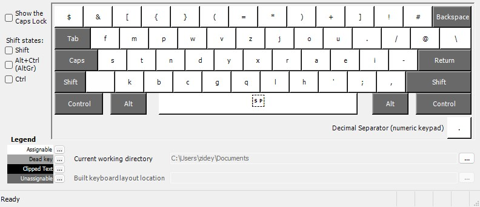
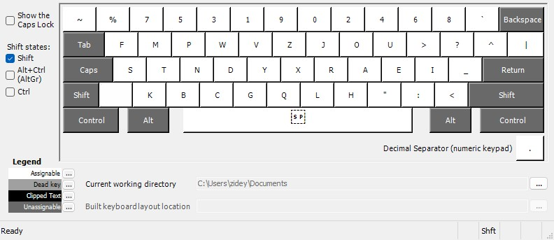
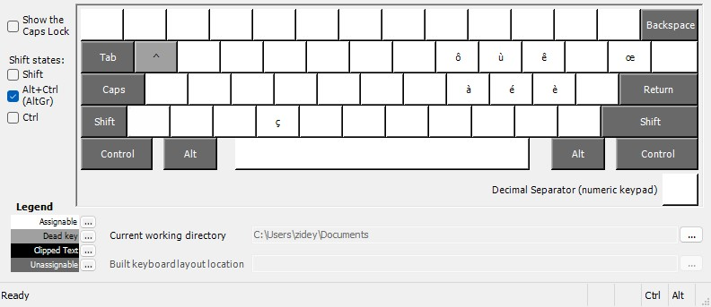

# Custom Keyboard Layout

This repository contains a custom keyboard layout created with **Microsoft Keyboard Layout Creator (MSKLC)**.

The default layer layout is called *Stand*. It's a layout that it similar to the famous *Sturdy*, with high rolls, low scissors, low redirections (for a rolly layout).
In the AltGr layer, I added my own modifications to account for typing french and code. By the way, the layout is surprisingly good for French, but only if you don't mind the `eu` Same Finger Bigram (that you should alt-finger).

If you are interested in the layout, you can follow the installation guide below.

## Layout Preview

### Default layout

### Shift layer

### AltGr layer

### Shift + AltGr layer

## Installation Guide (Windows onlys)

1. Download or clone this repository
2. Open the folder
3. Right-click `setup.exe`
4. Click **Run as administrator**
5. Restart your computer

## How to Enable the Keyboard

After installation:

1. Go to **Settings → Time & Language**
2. Select your language
3. Click **Language options**
4. Under **Keyboards**, add the custom layout (name is "stnd")
5. Switch using **Win + Space**

## Notes

- I am NOT the creator of *Stand*.
- Created using Microsoft Keyboard Layout Creator (MSKLC)
- Works on Windows 10 and Windows 11